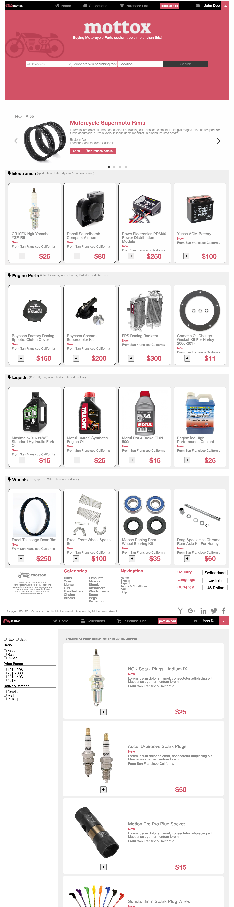

# capstone-project

Online Shop: HTML & CSS Capstone Project is based on an online shop for electronics. Following the desing of [ZATTIX](https://www.behance.net/gallery/24796463/ZATTIX) (by Mohammed Awad).

## Built With

- HTML
- CSS
- SCSS
- Javascript

## Live Demo

[Live Demo Link](https://mikethreels.github.io/capstone-project/)

## Video demonstrating the web-page

[click here](https://www.loom.com/share/e1b86163cc344b78979410899a2f0cb4)

## Getting Started

To get a local copy up and running follow these simple example steps.

git clone https://github.com/mikethreels/capstone-project
Open the index.html with your favorite browser
Explore the website

### Usage

- Just open the `index.html` file

## Commands
- `lintcss` Checks the css for any lint errors
- `lintcss:fix` Checks the css for any lint errors and tries to fix what it can

Note: You need to do `npm install` before executing the commands above.

## Authors

👤 **Michael Threels**

- Github: [@githubhandle](https://github.com/mikethreels)
- Twitter: [@twitterhandle](https://twitter.com/MichaelThreels)
- LinkedIn :[@linkedinhandle](https://www.linkedin.com/in/michael-threels-24101991)

## 🤝 Contributing

Contributions, issues and feature requests are welcome!

Feel free to check the [issues page](issues/).

## Show your support

Give a ⭐️ if you like this project!

## Acknowledgments

- Hat tip to anyone whose code was used
- Inspiration
- etc

## 📝 License

This project is [MIT](lic.url) licen
